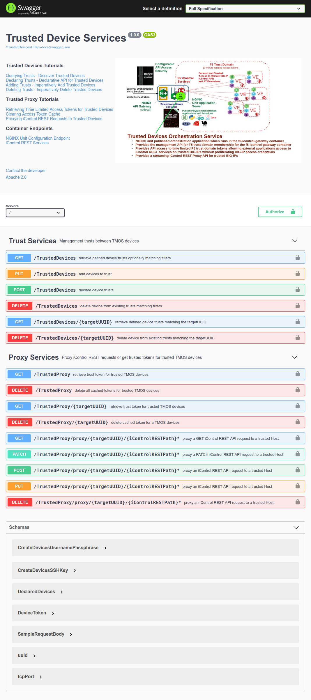

# Trusted Device Services - Swagger Edition

[See me published into an NGINX Unit runnng in a docker container! - f5-icontrol-gateway](https://cloud.docker.com/u/jgruberf5/repository/docker/jgruberf5/f5-icontrol-gateway)

```
docker run -p 8443:443 --rm --name f5-icontrol-gateway jgruberf5/f5-icontrol-gateway:latest
```

Open a browser to [https://localhost:8443](https://localhost:8443)

## Overview

This is a nodejs based application which expects to be co-resident with `restjavad` such that it can create device trusts and proxy trusted requests.

The application provides three URI namespaces:

- `/TrustedDevicesUI` - the SwaggerUI explorer web UI.
- `/TrustedDevices` - used to manage the device trusts between the local `restjavad` instance and remote TMOS devices.
- `/TrustedProxy` - used to either retrieve query parameter based trust tokens or to proxy signed iControl REST requests to remote TMOS devices.

This application was written 'schema first'. The OpenAPI schema for this application can be found in the `./api/swagger.yaml` file and is served up as `/api-docs/swagger.json` through the `swagger-ui` interface. The application service uses OAS-tools, `swagger-middleware` to validate requests against the schema. The `swagger-ui` was updated to support testing the application through the `swagger-ui` XHR browser client. To support static publishing, the `swagger-ui-dist` module was used.

How is this different than the `f5-api-services-gateway` iControl LX based extension for `TrustedDevices` and `TrustedProxy`? It contains zero iControl LX code. It uses direct nodejs `http` and `https` module queries. It also does not mangle your HTTP requests headers 'automagically' the way the iControl LX framework does.

### Running the server

To run the server, run:

```bash
npm start
```

To view the Swagger UI interface:

```bash
open http://localhost:3000/TrustedDevicesUI
```


